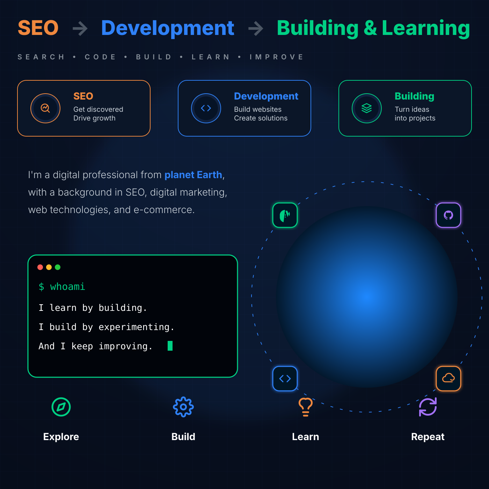

<!-- Profile Views Counter (Aligned Right) -->


# Hey, you got me! 👋 

<div align="left"> 
  
  <!-- Top Metrics Header (Displays Name, Join Date, and Contributed Repositories) -->
   

  <!-- Dynamic Contribution Activity Graph (Custom Vercel deployment) -->
  
    
  <!-- GitHub Contribution Grid Snake Animation (Includes Light/Dark mode sources) -->
  <picture>
    <source media="(prefers-color-scheme: dark)" srcset="https://raw.githubusercontent.com/Hamza-Jawaid/Hamza-Jawaid/output/github-contribution-grid-snake-dark.svg">
    <source media="(prefers-color-scheme: light)" srcset="https://raw.githubusercontent.com/Hamza-Jawaid/Hamza-Jawaid/output/github-contribution-grid-snake.svg">
    
  </picture>
  
  <div align="center">
    <!-- Bottom Metrics Section (Displays Top Languages) -->
    
    <br>
    <!-- GitHub Streak Stats Card (Generated locally via GitHub Actions) -->
    
  </div>

</div>
<!-- What I Do Cards -->

<!-- Journey Cards -->


## 🛠️ Technologies & Tools

### Web & Development

<p>

</p>

### Tools & Platforms

<p>

</p>

I'm continuously exploring new technologies and adding new tools to my stack.

## 🔨 What I'm Building

I enjoy creating projects that challenge me to learn something new.

Currently, my interests include:

**🌐 Web Applications**
Building useful websites and custom web experiences.

**🛍️ E-commerce**
Creating better ways to sell, manage, and discover products online.

**🤖 Automation & Bots**
Turning repetitive tasks into automated workflows and tools.

**📊 SEO & Web Tools**
Experimenting with tools and systems around search, websites, and performance.

**🧪 Experiments**
Small ideas, prototypes, and projects built simply to learn something new.

---

## 🌱 Currently Learning

```text
Modern Web Development
        ↓
Backend & APIs
        ↓
Databases & Architecture
        ↓
Automation & Integrations
        ↓
Performance & SEO
        ↓
Better UI / UX
